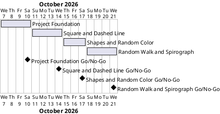

# Project Plan: Turtle Challenges

## Metadata
| Key | Value |
| --- | --- |
| ID | PP-001 |
| CrossReference | [BC-001], [SA-001], [MIL-001], [MIL-002], [MIL-003], [MIL-004] |
| Language | en |
| Domain | it |

## Version History
| Date | Status | Author | Reviewer | Change | Commit |
| --- | --- | --- | --- | --- | --- |
| 2026-10-07 | Proposed | Jens Tirsvad Nielsen | S01 | Initial version | pending |

---

## Purpose

This plan schedules the four milestones that deliver the Turtle Challenges repository, one milestone per pull request, so that the work is complete by 2026-10-21, the end date in the constraints of [BC-001]. Each milestone is one `MIL-*` document with its own tasks; the tasks become issues on the git host.

## Planning Assumptions

- Week 1 starts 2026-10-07; the plan ends by 2026-10-21, per the Business Case constraint.
- Milestone length: three to four days, the length of one small pull request.
- S01 is the owner and the approving reviewer of every milestone (see [SA-001]); communication with S01 follows the cadence of the Stakeholder Analysis: at every milestone.
- The milestone dates are proposals; S01 confirms or moves them when reviewing this plan.
- One branch per milestone, named after it (`mil-001-project-foundation` and so on), opened as one pull request that closes its issues.

## Gateway Schedule

| Gateway | Document | Window | Decision date | Owner | Stories | Main deliverable | Milestone |
| --- | --- | --- | --- | --- | --- | --- | --- |
| Project Foundation | [MIL-001] | 2026-10-07 to 2026-10-10 | 2026-10-10 | S01 | none | `pyproject.toml`, `.gitignore`, package and test skeleton, `Doxyfile`, continuous integration, README, repository description and topics | |
| Square and Dashed Line | [MIL-002] | 2026-10-11 to 2026-10-14 | 2026-10-14 | S01 | none | `Pen` protocol, `draw_square`, `draw_dashed_line`, fake turtle, tests, command line entry | |
| Shapes and Random Color | [MIL-003] | 2026-10-15 to 2026-10-17 | 2026-10-17 | S01 | none | `random_color`, color palette, `draw_shape`, `draw_shapes`, tests | |
| Random Walk and Spirograph | [MIL-004] | 2026-10-18 to 2026-10-21 | 2026-10-21 | S01 | none | `random_walk`, `draw_spirograph`, tests, final README | |



## Scope Coverage

| Business Case scope item | Gateway |
| --- | --- |
| `src/`, `tests/`, `docs/` structure, `constants.py`, `pyproject.toml` | [MIL-001] |
| Python `.gitignore` | [MIL-001] |
| pytest, ruff and mypy set-up | [MIL-001]; each later milestone adds its tests |
| Continuous integration workflow | [MIL-001] |
| `Doxyfile` and the command to build the documentation | [MIL-001]; each later milestone keeps 0 warnings |
| README with set-up for Windows PowerShell, Linux Debian and macOS | [MIL-001] (first version), [MIL-004] (final) |
| Description and topics on the Gitea host and on GitHub | [MIL-001] |
| Challenge 1, draw a square | [MIL-002] |
| Challenge 2, draw a dashed line | [MIL-002] |
| Challenge 3, draw different shapes, and the `random_color` helper | [MIL-003] |
| Challenge 4, generate a random walk | [MIL-004] |
| Challenge 5, draw a spirograph | [MIL-004] |

## Dependencies

```
MIL-001 → MIL-002 → MIL-003 → MIL-004
```

Each milestone needs the previous one `Accepted` with a Go review. A No-Go returns the milestone for rework and every later window moves by the rework time; the end date 2026-10-21 has no slack beyond the windows, so a No-Go on any milestone means S01 re-plans the remaining dates instead of letting them slide unrecorded.

## Plan Risks

| Risk | Impact | Mitigation |
| --- | --- | --- |
| A milestone slips and the end date 2026-10-21 is missed | The deadline in [BC-001] is missed | Milestones are small; a No-Go triggers a re-plan with S01 and a new row in this document's Version History |
| The `Pen` protocol of [MIL-002] is wrong, and [MIL-003] and [MIL-004] build on it | Rework spreads over three milestones | Criteria 1, 2 and 5 of [MIL-002] test the protocol with the fake turtle before anything depends on it |
| The Gitea host has no Actions runner | Continuous integration cannot confirm the checks | Every milestone records the local results of pytest, ruff, mypy and Doxygen in its review; see the open issue below |
| A token in `.env` expires or lacks a scope | Issues or repository metadata cannot be created | S01 renews the token; the dry run of `sync-project.sh` shows the plan without a token |

## Open Issues

- **Python bound:** "Python greater than 3.13" is read as `>=3.13` (3.13.14 is installed on S01's machine). If a version newer than 3.13 is meant, `requires-python` and the continuous integration version change to 3.14 or later, which is not installed.
- **Dashed line length:** Turtle Challenge 2 says "a total of 50 segments", while the lecture's loop runs 15 times. The plan uses 50 dashes as a constant (`DASH_COUNT`) in `constants.py`; S01 confirms or sets 15.
- **README template:** the agreed README template (Requirements, Set up, Run, Run the tests, Continuous integration, Build the source documentation, Project layout, License) differs from `framework/templates/README-template.md`. `framework/scripts/check-readme.sh` would flag the difference if its opt-in check were enabled; the agreed template is followed. S01 decides whether the framework check stays off.
- **Use cases and user stories:** every task is a plain technical task. The program has one actor and one action (run a challenge), so no `UC` or `US` is written. S01 confirms.
- **Development tools:** ruff and mypy are added as development dependencies, beyond the pytest the brief names, because `QC-PY-001` requires a formatter, a linter and (optionally) a strict type check. They are not runtime dependencies.
- **Continuous integration host:** the workflow lives in `.github/workflows/ci.yml`, which GitHub Actions and Gitea Actions both read. Whether the Gitea host has a runner is not known.
- **Diagram:** the PlantUML Gantt chart is not rendered yet because no PlantUML server is configured (`render-diagrams.sh --server <url>`).
- **Reviews:** [BC-001], [SA-001], `DICT-001` and the four milestones were reviewed and ended in `Go` on 2026-10-07 (`RC-007` to `RC-013`, which re-review `RC-001` to `RC-006`); their Version History rows are `Accepted`. S01 accepted, in chat, that the author is also the reviewer, because the project has one person and no governance document exists. This plan has no checklist, so S01 accepts it directly: its row is still `Proposed`. S01 waived the plan-first gate in chat on 2026-10-07 for the first build, so the code of all four milestones was written before any document was reviewed; the waiver does not carry over to the next request. The code has not been reviewed against `QC-PY-001` yet.
- **GitHub:** issues are synced to the `origin` remote (the Gitea host) only; the GitHub mirror gets the description and topics but no milestones or issues.

---

[BC-001]: ./business-case.md
[SA-001]: ./stakeholder-analysis.md
[MIL-001]: ./milestones/mil-001-project-foundation.md
[MIL-002]: ./milestones/mil-002-square-and-dashed-line.md
[MIL-003]: ./milestones/mil-003-shapes-and-random-color.md
[MIL-004]: ./milestones/mil-004-random-walk-and-spirograph.md
